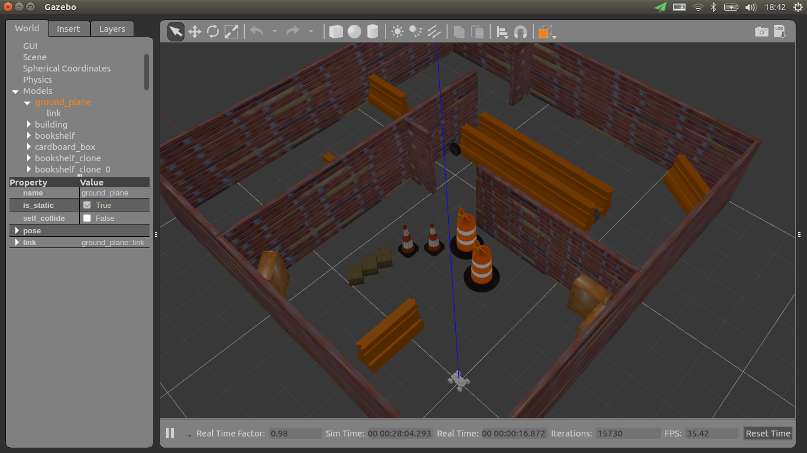
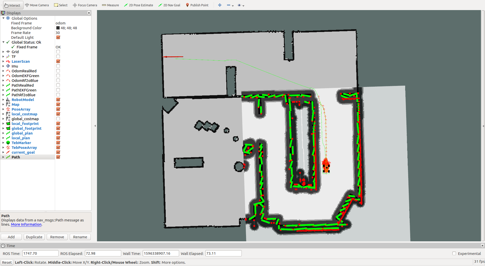

# ROS机器人导航仿真

# 1. 描述

**本工程参加第十五届全国大学生智能汽车竞赛室外光电组，并获得全国总决赛一等奖(第三名)**

**主要程序设计：刘力铭、严一展、闵文彦；主要硬件设计：周明俊、余婉婷**

本工程包含机器人3D仿真模型、仿真软件设置、ROS功能包设置等，能够完成Gazebo软件仿真下的定位、建图、导航功能.也能完成实体机器人的导航任务


# 2. 前置技术

在学习本工程之前，您应该掌握一下技能：

- 熟练使用C++或者Python（推荐精通C++，能看懂Python）

- CET六级以上英语阅读水平（或者使用Chrome浏览器内置的网页翻译功能，但机翻基本看不懂，如果您无法接受英文形式的资料，那么恕我直言，您没有资格学好ROS）

- 科学上网软件

# 3. 安装

#### 1.安装ubuntu操作系统 （推荐ubuntu 16.04 操作系统）

官方教程：http://www.wmcollege.club/front/couinfo/197

#### 2.在ubuntu上安装ROS

官方教程：http://wiki.ros.org/ROS/Installation

或者使用本工程提供的bash文件`bash install_ros.bash`（版本为kinetic，若需要安装其他版本，请直接将bash文件中的`rosversion="kinetic"`更改为其他版本），输入指令：

```
cd install
bash install_ros.sh
```

#### 3.安装本工程使用的ROS功能包

使用本工程提供的bash文件`bash install_ros_pkg.bash`（版本为kinetic，若需要安装其他版本，请直接将bash文件中的`rosversion="kinetic"`更改为其他版本），输入指令：

```
cd install
bash install_ros_pkg.sh
```

#### 4.如果gazebo版本为 7.0.0 版本，请更新gazebo

官方教程：http://gazebosim.org/tutorials?tut=install_ubuntu&cat=install

或使用本工程提供的bash文件，输入指令：

```
cd install
bash update_gazebo.sh
```

#### 5.修改地图文件

找到 `src\racecar_launch_realrobot\map` 和 `src\racecar_launch_simulator\map` 文件夹

打开全部 *.yaml 文件，找到第一行属性image，将该参数对应的文件地址修改成你电脑上对应的文件地址

# 4. 如何学习

#### 通用

http://www.baidu.com

http://www.google.com

本工程中所使用的roslaunch文件写法比较繁琐，同时使用了很多的算法节点，先[学习roslaunch语法](http://wiki.ros.org/roslaunch/XML)，然后通过wiki.ros.org学习本工程所使用的开源算法节点。同时，在doc文件夹中，也有关于SLAM的毕业设计论文，详细阅读可以增加对本工程的理解

也可以下载其他相似的基础开源工程，通过依样画葫芦学习.

#### ROS

基本使用方法：http://www.wmcollege.club/front/couinfo/197

官网：http://wiki.ros.org/  在官网页面的右上角，可以搜索ROS的相关问题以及ROS功能包（搜索需要科学上网）。如果已知功能包的名称，可以在官网地址后加上功能包名称直接访问，如http://wiki.ros.org/move_base

ROS导航官方教程：http://wiki.ros.org/navigation/Tutorials

#### Gazebo

官网教程：http://gazebosim.org/tutorials （可以重点学习Get Started、Build a Robot、Model Editor、Build a World、Sensors、Connect to ROS章节）

# 5. 开始仿真

**1 编译:** 使用`catkin_make`正确编译本工程，并 `source devel/setup.sh`

**2 开始仿真:** 执行以下指令来打开Gazebo仿真环境，指令意思为:打开仿真功能，指定仿真世界为racetrack，指定机器人的起始x坐标为-0.5

(如果报错，找到src/racecar_launch_simulator/map/racetrack.yaml，修改该文件第一行image:的文件地址)

```
roslaunch racecar_launch_simulator run_all.launch simulator:=true world_name:=racetrack origin_x:=-0.5
```

指令执行完成后，若无错误，您将看到Gazebo软件被打开，Gazebo中有仿真的赛道，障碍物和机器人，还有一个叫做tk的窗口，选定该窗口并按下键盘的wasd按键可以控制机器人移动

gazebo软件显示如下图所示(可能视角有所不同):



**3 建图:** (可跳过)执行以下指令打开Rviz软件并运行gmapping算法开始构建地图

```
roslaunch racecar_launch_simulator run_all.launch gmapping:=true rviz_full:=true
```

控制仿真机器人在地图中移动，直到Rviz中显示的地图完整，然后执行以下指令保存地图数据

```
roslaunch racecar_launch_simulator run_all.launch savemap:=true world_name:=your_map_name
```

**4 单点导航:** (请先关闭所有roslaunch命令，重新打开仿真命令后再执行该命令)执行定位、导航功能包

```
roslaunch racecar_launch_simulator run_all.launch navigation:=true world_name:=racetrack rviz_full:=true
```

在Rviz的上方工具栏中找到"2D Nav Goal"，选择该工具，然后在Rviz的地图上指定导航终点，导航开始，Rviz软件显示如下图所示:



注意:导航能否完成与您的电脑配置有关，若无法完成导航任务，可以找到src\racecar_launch_simulator\param\racecar_control\pure_pursuit_params.yaml，适当降低Vcmd_max和Vcmd_min和其他参数的值。同时注意Gazebo软件左下角的"Real Time Factor"为0.5代表仿真是以0.5倍速度运行的

**5 多点导航:**

规则详见:[第十五届全国大学生智能汽车竞赛室外光电组全国总决赛方案](https://blog.csdn.net/zhuoqingjoking97298/article/details/107901873)

5.1 打开仿真:

```
roslaunch racecar_launch_simulator run_all.launch simulator:=true world_name:=warehouse  origin_x:=-7 origin_y:=4.25 origin_yaw:=0
```

5.2 打开导航算法:

```
roslaunch racecar_launch_simulator run_all.launch navigation:=true world_name:=warehouse rviz_full:=true
```

5.3 在Rviz软件的上方工具栏中找到"2D Pose Estimate"，选择该工具，然后在Rviz的地图上指定机器人大致的起始位置(与Gazebo中的机器人位置相同)，随后算法会自动修正

5.4 发布多点导航服务开始多点导航

```
rosservice call /multi_goals_navigation_node/start_navigation "{}"
```

注意:多点导航的参数在src\racecar_launch_simulator\param\racecar_control\multi_goals_navigation_params.yaml中可以找到.如果需要使用自己的地图或者调试参数，请先看懂multi_goals_navigation.cpp

# 6. 使用实体车模


#### 指令
实体机器人指令与仿真指令相似，程序上有很多重复

6.1 使用`catkin_make`正确编译本工程，并 `source devel/setup.sh`

6.2 打开传感器

```
roslaunch racecar_launch_realrobot run_all.launch realrobot:=true
```

6.3 执行定位、导航功能包

```
roslaunch racecar_launch_realrobot run_all.launch navigation:=true world_name:=warehouse rviz_full:=true
```

6.4 在Rviz软件的上方工具栏中找到"2D Pose Estimate"，选择该工具，然后在Rviz的地图上指定机器人大致的起始位置(与实际环境的机器人位置相同)，随后算法会自动修正

6.5 发布多点导航服务开始多点导航

```
rosservice call /multi_goals_navigation_node/start_navigation "{}"
```

#### 车模参数

轴距 33.5cm

轮距 28.5cm

imu (0，0，0) 单位cm

laser （-9，0，9) 单位cm

base_link （-18，0，-5) 单位cm

转向半径 左 90cm

转向半径 右 105cm

车footprint 40cm x 60cm

右最大打角 35度 0.6108652382

左最大打角 35度 0.6108652382

#### 电调设置

运行模式:直接正反转

拖刹力度:100%

电池低压保护阈值:3.0V/Cell

启动模式:4级

最大刹车力度:75%

最大倒车力度:100%

初始刹车力度:0%

油门中立点区域宽度:6%(窄)

进角:0.00度
