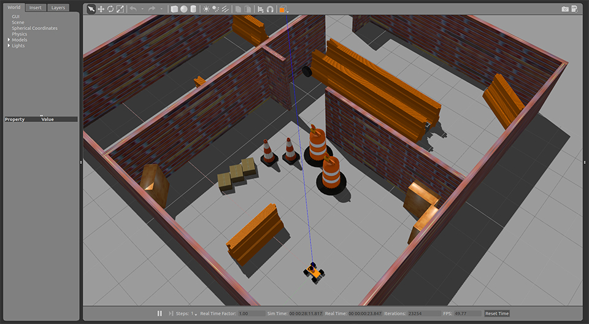

# ROS机器人导航

# 1. 描述

**主要程序设计：刘力铭、严一展、闵文彦；主要硬件设计：周明俊、余婉婷**

**本工程参加第十五届全国大学生智能汽车竞赛室外光电组，并获得全国总决赛一等奖(第三名)**


本工程包含机器人3D仿真模型、仿真软件设置、ROS功能包设置等，能够使用Gazebo仿真软件或实体机器人完成定位、建图、导航功能。同时，因为本工程具有仿真功能，因此本工程也非常适合学习ROS、导航算法。



# 2. 前置技术（劝退）

在学习ROS（并非本工程如此刁难）之前，您应该掌握以下技能：

- **熟练使用C++或者Python**（推荐精通C++，能看懂Python）

- **CET六级以上英语阅读水平**（或者使用Chrome浏览器内置的网页翻译功能，但机翻基本看不懂，**如果您无法接受英文形式的资料，那么恕我直言，您没有资格学好ROS**）

- 帮助您登入外网的**翻墙软件**

- 如果想真正弄懂算法背后的原理，您还需要具备良好的数学基础，**线性代数和概率论**尤其重要。

# 3. 如何学习

### 如何学习ROS

**ROS的基本教程（必看）**：http://www.wmcollege.club/front/couinfo/197

**ROS官网**：http://wiki.ros.org/  在官网页面的右上角，可以搜索ROS的相关问题以及ROS功能包（搜索需要翻墙）。

**本工程使用的重要开源算法的官网：**

- RF2O算法，从激光雷达的数据中得到机器人的线速度、角速度数据：http://wiki.ros.org/rf2o_laser_odometry

- 扩展卡尔曼滤波算法：http://wiki.ros.org/robot_localization

- Gmapping算法：http://wiki.ros.org/gmapping

- 自适应蒙特卡洛定位(AMCL)算法：http://wiki.ros.org/amcl

- 导航算法：http://wiki.ros.org/move_base

### 如何学习Gazebo

官网教程：http://gazebosim.org/tutorials （可以重点学习Get Started、Build a Robot、Model Editor、Build a World、Sensors、Connect to ROS章节）

### 如何学习本工程

先讲讲ROS的基本概念，我认为：ROS本身就是一个通讯机制，一个机器人系统上会运行多个Node，而Node则代表了实现某某算法的节点，ROS Master通过Topic和Service的机制帮助多个Node之间互相通讯，最终多个Nodes协作完成任务。 **所以学习ROS的难点不在于ROS本身，而在于理解Node代表的算法等问题。** 比如，对于ROS的导航项目，难点在于如何得到机器人的定位、如何规划导航路径、如何进行运动控制、如何将这些算法组合使用，而ROS本身并不难。

**学习步骤：**
1. 学习Ubuntu、ROS的基本教程。
2. 如果你之前没有接触过ROS的相关项目，那么建议你不要直接使用该项目作为入门项目（因为太复杂了），你可以去网上找一些带详细解释的仿真导航教程（我随便找了一个，https://blog.csdn.net/crp997576280/article/details/102983855 ），按照教程的步骤实现导航。
3. 确认教程能够实现后，你会发现，教程使用了很多的`roslaunch`指令来实现导航，该指令的意义是：根据某个.launch文件的设置，一次性做很多的事、打开很多的Node。那么，理解roslaunch指令做了的事也就学会了该项目。
4. 学习roslaunch语法(http://wiki.ros.org/roslaunch/XML)。
5. 再回到教程，重新依次执行教程中的指令，每执行一个roslaunch指令，就找到其对应的.launch文件，看懂这个文件，同时配合`rosnode info xxx`和`rostopic info xxx`等ubuntu指令观察Node信息，问问自己以下问题：这个launch文件做了什么设置，打开了什么节点？该节点的作用是什么（如果是开源算法则去官网或者github查询，如果不是需要看算法源文件夹下的README文件或者直接看程序）？该节点的输入数据从何而来，有什么意义？该节点的输出数据又有什么意义？最终这个.launch文件起到了什么效果？

**一句话总结就是：当你能够彻底理解一个工程中所有的roslaunch命令，那么你就学会了这个项目。而ROS框架下的导航工程结构都是大同小异的，学会了一个就学会了全部。**

同时，在doc文件夹中，也有做这个项目留下的毕业设计论文（[基于多传感器融合的室内移动机器人定位系统.pdf](doc/基于多传感器融合的室内移动机器人定位系统.pdf)），里面详细讲解了本工程中定位部分的原理，详细阅读可以增加对本工程的理解。

# 4. 项目文件结构

+ doc：包括描述图片和用于参考的论文
+ install：包括ROS功能包的安装指令文件
+ src：包含所有的代码
	- racecar_algorithm：主要包括机器人使用的算法
		* data_recorder：用于记录数据的算法（调试使用）
		* pure_mapping：不使用任何修正算法的建图算法（调试使用）
		* racecar_control：**核心算法**，是这个比赛中需要自行编写的程序，包括多点导航算法和路径追踪算法。
		* rf2o_laser_odometry：RF2O算法
	- racecar_hardware：主要包括机器人使用的硬件驱动程序，详见https://github.com/ART-Robot-Release/racecar
	- racecar_launch_realrobot：主要包括实体机器人启动有关的工程
		* launch：启动.launch文件
		* map：存放地图文件
		* param：存放节点参数文件
	- racecar_launch_simulator：主要包括仿真机器人启动有关的工程，结构与_realrobot相同。
	- racecar_simulator：与Gazebo仿真有关的工程
		* racecar_description：主要包括仿真机器人的模型文件和.urdf描述文件。
		* racecar_gazebo：主要包括Gazebo的环境描述.world文件，Gazebo启动文件，仿真机器人的运动控制设置等等与Gazebo相关的文件。

# 5. 安装

#### 1.安装ubuntu操作系统 （推荐ubuntu 16.04 操作系统）

官方教程：http://www.wmcollege.club/front/couinfo/197

在您学会ubuntu和ROS的基本操作后，建议您安装双系统（即ubuntu和ROS），教程：https://www.cnblogs.com/masbay/p/10745170.html

#### 2.在ubuntu上安装ROS

官方教程：http://wiki.ros.org/ROS/Installation

或者使用本工程提供的bash文件`bash install_ros.bash`（版本为kinetic，若需要安装其他版本，请直接将bash文件中的`rosversion="kinetic"`更改为其他版本），输入指令：

```
cd install
bash install_ros.sh
```

#### 3.安装本工程使用的ROS功能包

使用本工程提供的bash文件`bash install_ros_pkg.bash`（版本为kinetic，若需要安装其他版本，请直接将bash文件中的`rosversion="kinetic"`更改为其他版本），输入指令：

```
cd install
bash install_ros_pkg.sh
```

#### 4.如果gazebo版本为 7.0.0 版本，请更新gazebo

官方教程：http://gazebosim.org/tutorials?tut=install_ubuntu&cat=install

或使用本工程提供的bash文件，输入指令：

```
cd install
bash update_gazebo.sh
```

#### 5.修改地图文件

找到 `src\racecar_launch_realrobot\map` 和 `src\racecar_launch_simulator\map` 文件夹

打开全部 *.yaml 文件，找到第一行属性image，将该参数对应的文件地址修改成你电脑上对应的文件地址

# 6. 开始仿真

**前置:** 在虚拟机上运行的Gazebo运算速度很慢，所以强烈推荐您安装双系统。

**1 编译:** 使用`catkin_make`正确编译本工程，并 `source devel/setup.sh`

**2 开始仿真:** 执行以下指令来打开Gazebo仿真环境，指令意思为:打开仿真功能，指定仿真世界为racetrack，指定机器人的起始x坐标为-0.5

(如果报错，找到src/racecar_launch_simulator/map/racetrack.yaml，修改该文件第一行image:的文件地址)

```
roslaunch racecar_launch_simulator run_all.launch simulator:=true world_name:=racetrack origin_x:=-0.5
```

指令执行完成后，若无错误，您将看到Gazebo软件被打开，Gazebo中有仿真的赛道，障碍物和机器人，还有一个叫做tk的窗口，选定该窗口并按下键盘的wasd按键可以控制机器人移动

gazebo软件显示如下图所示(可能视角有所不同):


**3 建图:** (可跳过)执行以下指令打开Rviz软件并运行gmapping算法开始构建地图

```
roslaunch racecar_launch_simulator run_all.launch gmapping:=true rviz_full:=true
```

控制仿真机器人在地图中移动，直到Rviz中显示的地图完整，然后执行以下指令保存地图数据

```
roslaunch racecar_launch_simulator run_all.launch savemap:=true world_name:=your_map_name
```

**4 单点导航:** (请先关闭所有roslaunch命令，重新打开仿真命令后再执行该命令)执行定位、导航功能包

```
roslaunch racecar_launch_simulator run_all.launch navigation:=true world_name:=racetrack rviz_full:=true
```

在Rviz的上方工具栏中找到"2D Nav Goal"，选择该工具，然后在Rviz的地图上指定导航终点，导航开始，Rviz软件显示如下图所示:


注意:导航能否完成与您的电脑配置有关，若无法完成导航任务，可以找到src\racecar_launch_simulator\param\racecar_control\pure_pursuit_params.yaml，适当降低Vcmd_max和Vcmd_min和其他参数的值。同时注意Gazebo软件左下角的"Real Time Factor"为0.5代表仿真是以0.5倍速度运行的

**5 多点导航:**

规则详见:[第十五届全国大学生智能汽车竞赛室外光电组全国总决赛方案](https://blog.csdn.net/zhuoqingjoking97298/article/details/107901873)

5.1 打开仿真:

```
roslaunch racecar_launch_simulator run_all.launch simulator:=true world_name:=warehouse  origin_x:=-7 origin_y:=4.25 origin_yaw:=0
```

5.2 打开导航算法:

```
roslaunch racecar_launch_simulator run_all.launch navigation:=true world_name:=warehouse rviz_full:=true
```

5.3 在Rviz软件的上方工具栏中找到"2D Pose Estimate"，选择该工具，然后在Rviz的地图上指定机器人大致的起始位置(与Gazebo中的机器人位置相同)，随后算法会自动修正

5.4 发布多点导航服务开始多点导航

```
rosservice call /multi_goals_navigation_node/start_navigation "{}"
```

注意:多点导航的参数在src\racecar_launch_simulator\param\racecar_control\multi_goals_navigation_params.yaml中可以找到.如果需要使用自己的地图或者调试参数，请先看懂multi_goals_navigation.cpp

# 7. 使用实体车模


#### 指令

实体机器人指令与仿真指令相似，程序上有很多重复

6.1 使用`catkin_make`正确编译本工程，并 `source devel/setup.sh`

6.2 打开传感器

```
roslaunch racecar_launch_realrobot run_all.launch realrobot:=true
```

6.3 执行定位、导航功能包

```
roslaunch racecar_launch_realrobot run_all.launch navigation:=true world_name:=warehouse rviz_full:=true
```

6.4 在Rviz软件的上方工具栏中找到"2D Pose Estimate"，选择该工具，然后在Rviz的地图上指定机器人大致的起始位置(与实际环境的机器人位置相同)，随后算法会自动修正

6.5 发布多点导航服务开始多点导航

```
rosservice call /multi_goals_navigation_node/start_navigation "{}"
```

#### 车模参数

轴距 33.5cm

轮距 28.5cm

imu (0，0，0) 单位cm

laser （-9，0，9) 单位cm

base_link （-18，0，-5) 单位cm

转向半径 左 90cm

转向半径 右 105cm

车footprint 40cm x 60cm

右最大打角 35度 0.6108652382

左最大打角 35度 0.6108652382

#### 电调设置

运行模式:直接正反转

拖刹力度:100%

电池低压保护阈值:3.0V/Cell

启动模式:4级

最大刹车力度:75%

最大倒车力度:100%

初始刹车力度:0%

油门中立点区域宽度:6%(窄)

进角:0.00度

# 8. 已知问题和算法改进

尽管本工程在比赛上取得了很好的成绩，但是还是存在诸多问题，比如：在速度较快的时候（> 2m/s)，机器人定位会出现严重问题，进而影响导航算法的决策

因此，特新建一个项目 https://gitee.com/ZUSTSmartCar/Code_Pilotless_Driving_14_Plus ，在本项目的基础上，深入研究，改进算法
