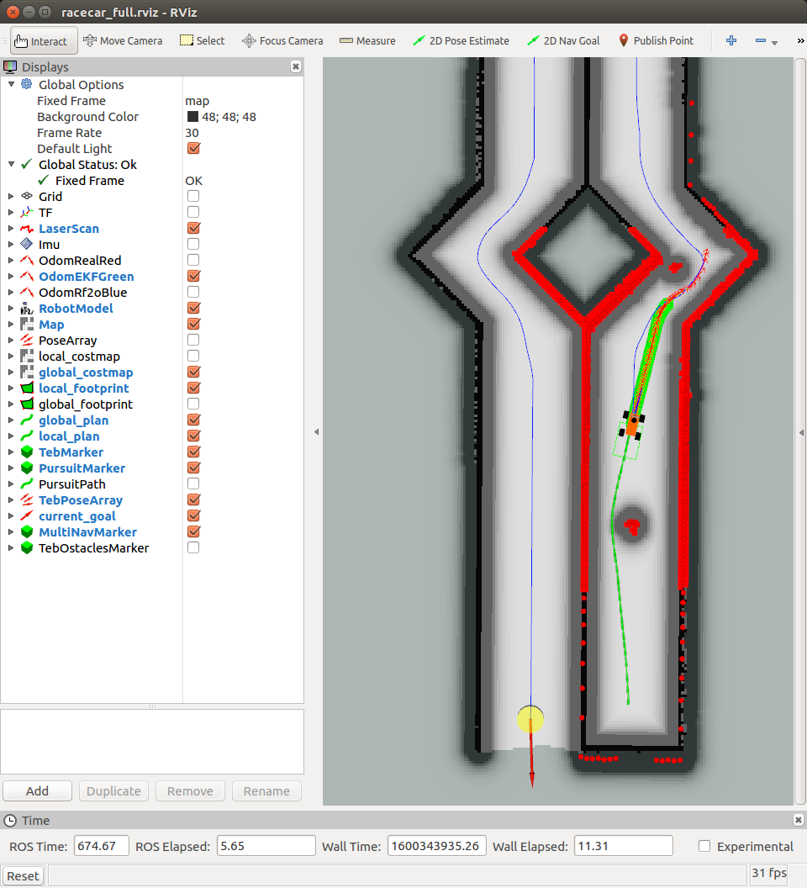

# ROS机器人导航仿真

---

## 描述

本工程包含机器人3D仿真模型、仿真软件设置、ROS功能包设置等，能够完成Gazebo软件仿真下的定位、建图、导航功能。

## 前置技术

在学习本工程之前，您应该掌握一下技能：

- 熟练使用C++或者Python（推荐C++）

- CET六级以上英语阅读水平（或者使用Chrome浏览器内置的网页翻译功能，但机翻基本看不懂）

- 科学上网软件

## 安装

- 1 安装ubuntu操作系统

教程：http://www.wmcollege.club/front/couinfo/197

- 2 在ubuntu上安装ROS

官方教程：http://wiki.ros.org/ROS/Installation

或者使用本工程的bash文件`bash install_ros.bash`（版本为kinetic，若需要安装其他版本，请直接将.bash文件中的`rosversion="kinetic"`更改为其他版本）

- 3 安装本工程使用的ROS功能包

使用本工程的bash文件`bash install_ros_pkg.bash`（版本为kinetic，若需要安装其他版本，请直接将.bash文件中的`rosversion="kinetic"`更改为其他版本）

- 4 更新gazebo（可选）

官方教程：http://gazebosim.org/tutorials?tut=install_ubuntu&cat=install

## 使用

- 1 使用`catkin_make`正确编译本工程

- 2 如果仿真，执行以下指令来打开Gazebo仿真环境(如果报错,找到racecar_launch/map/building.yaml,修改该文件第一行image:的文件地址)

    roslaunch racecar_launch run_all.launch simulator:=true world_name:=building

- 3 执行定位、导航功能包

    roslaunch racecar_launch run_all.launch navigation:=true world_name:=building rviz_full:=true
    
- 4 执行结果如下

## 如何学习

- 通用

http://www.baidu.com

http://www.google.com

下载别人开源的工程，通过依样画葫芦学习。

- ROS

基本使用方法：http://www.wmcollege.club/front/couinfo/197

官网：http://wiki.ros.org/  在官网页面的右上角，可以搜索ROS的相关问题以及ROS功能包（搜索需要科学上网）。如果已知功能包的名称，可以在官网地址后加上功能包名称直接访问，如http://wiki.ros.org/move_base

ROS导航官方教程：http://wiki.ros.org/navigation/Tutorials

- Gazebo

官网教程：http://gazebosim.org/tutorials （可以重点学习Get Started、Build a Robot、Model Editor、Build a World、Sensors、Connect to ROS章节）

